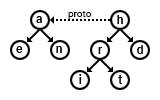

## lockdown()

The `lockdown` function freezes all JS built-ins.

- Once the `lockdown` function has been called, the `harden` function can be called.
- Snapshots preserve the state of the machine, pre and post lockdown.  

### Surgery

Besides freezing all JS built-ins, the `lockdown` function also modifies some built-ins as specified by Secure ECMAScript.

- The `constructor` property of the prototypes of function, generator and compartment instances are replaced by a function that always throws.

In compartments created after the execution of the `lockdown` function:

- The `Date` constructor is replaced by its secure version, which throws when called without arguments.
- The `Date.now` and `Math.random` functions are replaced by their secure versions, which always throw.

Here is a script to test such modifications. Firsly the script defines a string to evaluate in different contexts:

	const tests = `
		let result = "";
		function test(f) {
			try {
				f();
				result += 'Y';
			}
			catch {
				result += 'N';
			}
		}
		test(()=>new test.constructor(""));
		test(()=>new Date());
		test(()=>Date.now());
		test(()=>Math.random());
		print(result);
	`

Before lockdown:

	eval(tests); // YYYY
	
	const before = new Compartment({ print });
	before.evaluate(tests); // YYYY

After lockdown:

	lockdown();
	
	eval(tests); // NYYY
	
	const after = new Compartment({ print });
	after.evaluate(tests); // NNNN

## harden(o)

The `harden` function freezes the passed object, then hardens its prototypes and all its properties.

- The `harden` function throws if the `lockdown` function has not been called.
- The `harden` function does nothing if the passed object is no object.
- In order to respect ordinary and exotic behaviors, the `harden` function uses standard traps like `[[GetPrototypeOf]]`, `[[OwnPropertyKeys]]` and `[[GetOwnProperty]]`. Proxies can execute some JS code while hardening like while freezing.
- If the `harden` function fails, for instance if a proxy throws an exception, no traversed objects are hardened. But objects that have been frozen before the exception remain frozen.
- The `harden` function returns the passed object.
- XS uses an internal flag to mark hardened instances. It is the same flag that is used to mark instances in the read-only heap prepared by the XS linker for embedded devices.

### Traversal Order

The `harden` function traverses objects breadth first. The prototype of an object, if any, is treated like the first property of the object.

Here is a script to test the traversal order. Firstly the script defines a function that creates a proxy to observe `Object.freeze` thru the `[[PreventExtensions]]` trap: 

	let order = "";
	const handler = {
	  preventExtensions(target) {
	    order += target.name;
	    return Reflect.preventExtensions(target);
	  }
	}
	function createObservable(proto, name) {
	  const target = Object.create(proto);
	  target.name = name;
	  return new Proxy(target, handler);
	}

Then the script uses such function to build this hierarchy:
	

	
	const a = createObservable(null, "a");
	a.e = createObservable(null, "e");
	a.n = createObservable(null, "n");
	const h = createObservable(a, "h");
	h.r = createObservable(null, "r");
	h.r.i = createObservable(null, "i");
	h.r.t = createObservable(null, "t");
	h.d = createObservable(null, "d");
	
When hardening `h`, the script prints `hardenit`!	
	
	lockdown();
	harden(h);
	print(order);

## purify(o)

The experimental `purify` function checks the immutability of the passed object.

- The `purify` function checks the passed object, then checks its prototypes and all its properties.
- The `purify` function traverses objects breadth first. The prototype of an object, if any, is treated like the first property of the object.
- The `purify` function does not use standard internal methods so JS code is never executed while checking.
- The `purify` function returns a string: a `'\n'` separated list of all mutable property paths, or the empty string if all properties are immutable.

The behavior of the `purify` function is expected to change.

For instance

	lockdown();
	const o = {
		foo:88,
	};
	print(purify(o));

prints

	.foo

But

	lockdown();
	const p = harden({
		foo:88,
	});
	print(purify(p));

prints nothing.

The `purify ` function checks closures in function environments.

	lockdown();
	let v = 0;
	const o = {
		oops(i) {
			return v + i;
		},
	};
	harden(o);
	print(purify(o));

prints
	
	.oops[[Environment]].v

since `v` is variable.

But 

	lockdown();
	const c = 0;
	const p = {
		oops(i) {
			return c + i;
		},
	};
	harden(p);
	print(purify(p));

prints nothing since `c` is constant.

The `purify ` function also reports mutable private and internal propertes, which are currently not frozen by the `harden` function. 

	class C {
		#f
		constructor(f) {
			this.#f = f;
		}
	}
	const values = {
		c: new C(0),
		date: new Date('1993-3-28'),
		dataView: new DataView(new ArrayBuffer(10)),
		map: new Map([["a", 0],["b", 1],["c", 2],["d", 2]]),
		set: new Set([0, 1, 2, 3]),
		typedArray: new Uint8Array([0, 1, 2, 3]),
		weakMap: new WeakMap(),
		weakSet: new WeakSet(),
	};
	harden(values);
	print(purify(values));

prints

	.c.#f
	.date[[DateValue]]
	.dataView[[ViewedArrayBuffer]][[ArrayBufferData]]
	.map[[MapData]]
	.set[[SetData]]
	.typedArray[[ViewedArrayBuffer]][[ArrayBufferData]]
	.weakMap[[WeakMapData]]
	.weakSet[[WeakSetData]]

##override mistake

I did nothing to workaround the so-called "override mistake”:

	lockdown();
	const x = harden({foo: 88});
	const y = Object.create(x);
	y.foo = 99; // fail

In fact I tend to agree with Allen Wirfs-Brock: [it is not a mistake](https://web.archive.org/web/20141230041441/http://wiki.ecmascript.org/doku.php?id=strawman:fixing_override_mistake).

Even if you use JS as a protoype based language, it is always possible to override:

	Object.defineProperty(y, "foo", { value:99 });

And once you use JS as a class based language, there are no problems:

	lockdown();
	class C {
		constructor() {
		}
		test() {
			print("C");
		}
	}
	class D extends harden(C) {
		constructor() {
			super();
		}
		test() {
			print("D");
		}
	}
	const d = new D;
	d.test();

To be discussed, of course!